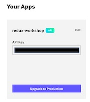

# Intro to Redux

## Today's 🔥 GIFs

## Objectives

- Understand, at a high level, what the following parts of redux are, and how they fit together:
  - redux store
  - reducers
  - actions
  - selectors
- Use thunks to allow for asynchronous workflows to update the redux store

## Why?

This lab is designed to give you an introduction to some of the most commonly used workflows in redux: fetching data from an API and storing it in a redux store, and then using data from the redux store in your application. You'll need to use these same workflows in your onboarding project.

As you learn redux and global state management more broadly, you may be thinking: "couldn't I just store all of this information in my components' state?" The answer is mostly yes. You absolutely could. As applications grow in complexity, however, global state management tools like Redux help to keep your application organized, which in turn improves maintainability and scalability. As you build an application, if you find yourself doing a lot of prop drilling, losing track of what information is stored in various components' states, or otherwise having trouble managing the data flow of your application, a state management tool like Redux might be a tool to consider.

## Directions

This lab has been tested in VSCode. You're welcome to run it elsewhere if you like, but the instructions are written with the assumption that you're operating on your code in the VSCode IDE.

## Getting Started:

1. Clone this repository down to your local environment and navigate to the root directory. Run `npm install` and then `npm start` to ensure you can preview your app.
1. Head to the [Giphy Developer Site](https://developers.giphy.com) and sign up for an account. Then head to the [dashboard](https://developers.giphy.com/dashboard/) and press the **+** icon in the **Your Apps** section to generate a new API key. You'll know you're ready to start the lab when your dashboard looks like:

   

1. Take some time to explore the app as it currently exists. Notice that it currently renders 5 gifs, which are coming from `src/data/sample_data.ts`. For this lab, we'll work to move our data fetching and storage from the data file to a redux store.

## Guidance:

1. **Add Sample Data to Redux Store** - to start this lab, we'll be working with the sample data file. The goal of this step is to take the data stored in the `src/data/sample_data.ts` file and store it in our redux store
1. **Incorporate stored data into the app**
1. **Fetch Data from API and add to Redux Store**

If you learn best by reading documentation first, then be sure to read the linked resources before attempting the corresponding challenges:

-

## Final Thoughts

- Takes time
- Patterns will remain familiar - it's okay if you don't understand everythign right away, and are pattern-matching for a little while
